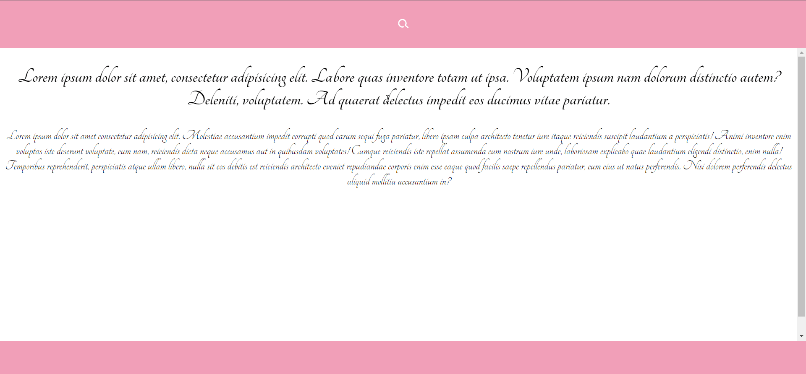

## SEARCH CUSTOM
Проект содежит поиск анимированый поиск,
c использованием css perspective

<div align="left">



# 
## Для запуска потребуется
- этот репозиторий 
 ```
git clone https://github.com/VladislavBobyrev/search-custom
```
- node.js 
 
```
https://nodejs.org/en/
```

- Live Sass Compiler

 
```
https://marketplace.visualstudio.com/items?itemName=ritwickdey.live-sass
```

- браузер

#
## Связвться со мной
<div align='center'> 
 
 ```
vladislavbobyrev@yandex.ru
```
 
 [](https://t.me/VladislavBobyrev)

 </div>
 
<div align="center">
  <h2>**ВНИМАНИЕ!**  Вся конфигурация является открытой. </h2>
 
**ВНИМАНИЕ!** На компьютере должны быть установлены программы `node` и `npm`.
Генерация  занимает много времени за счёт
установки `node_modules`. Необходимо дождаться окончания этого процесса.
 
</div>
